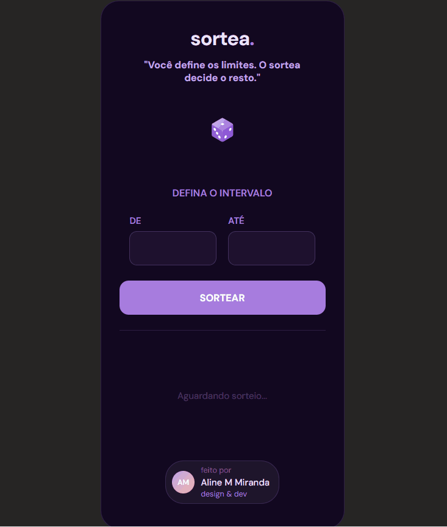

<div align="center">

# sortea.

**Gerador de números aleatórios com foco em experiência do usuário, validação de entradas e boas práticas de código.**



<br/>

[](https://aline-mmiranda.github.io/sortea/)


<br/>


</div>

---

## 📌 Sobre o projeto

**sortea.** surgiu de um exercício de curso que propunha implementar um gerador de números aleatórios entre dois valores — sem validações, sem feedback visual de estados e sem tratamento de erros.

A partir dessa base, o projeto foi expandido com foco em **experiência do usuário**, **robustez da lógica** e **organização do código**, consolidando conhecimentos em manipulação do DOM, gerenciamento de estados da interface e boas práticas de JavaScript.

A proposta é direta: o usuário define um intervalo, aciona o sorteio — e o app cuida do resto. Uma animação Lottie toca enquanto a lógica processa, o resultado é exibido com feedback visual claro e o estado é reiniciado automaticamente.

---

## 🚀 Além do exercício

O exercício original cobria apenas a geração do número aleatório. As implementações a seguir foram adicionadas de forma independente, com decisões técnicas deliberadas:

| Funcionalidade adicionada | Motivação técnica |
|---|---|
| Validação dos inputs com mensagens de erro | Robustez — evitar processamento silencioso com entradas inválidas |
| State machine para gerenciamento de estados da UI | Centralizar transições e evitar conflitos de classe no DOM |
| Animação Lottie durante o sorteio | Feedback visual enquanto o timer processa; integração com web component externo |
| Suporte à tecla `Enter` nos dois campos | Fluidez — o usuário não precisa do mouse para acionar o sorteio |
| Botão desabilitado durante o ciclo | Prevenção de múltiplos `setTimeout` concorrentes |
| Reset automático após o resultado | Retorno ao estado inicial sem ação adicional do usuário |
| Design responsivo com badge fixo no desktop | Experiência visual adaptada ao contexto de cada breakpoint |
| Remoção cross-browser dos spin buttons | Consistência visual entre Chrome, Safari e Firefox |
| Design visual completo | Layout, paleta, tipografia e animação inteiramente criados para o projeto |

---

## ✨ Funcionalidades

- 🎲 Animação de dado via Lottie durante o sorteio
- 🔢 Intervalo numérico definido pelo usuário, com inclusão dos dois extremos
- ✅ Validação de entradas com mensagens de erro contextuais
- ⌨️ Suporte ao teclado — pressione `Enter` em qualquer campo para sortear
- 🔄 Reset automático após o ciclo de resultado
- 🚫 Botão desabilitado durante a animação para evitar eventos duplicados
- 📱 Layout responsivo — card mobile e badge fixo no desktop

---

## 🛠️ Tecnologias

| Tecnologia | Uso |
|---|---|
| HTML5 | Estrutura semântica, marcação acessível de formulário, integração com web component |
| CSS3 | Flexbox, Grid, transições, compatibilidade cross-browser, design responsivo |
| JavaScript Vanilla | Manipulação do DOM, state machine, eventos, controle assíncrono |
| Lottie Player (CDN) | Animação do dado renderizada a partir de arquivo JSON via web component |
| Google Fonts — DM Sans | Tipografia |

---

## 📁 Estrutura do projeto

```
sortea/
├── index.html
└── assets/
    ├── style.css
    ├── script.js
    └── img/
        ├── favicon.png
        └── dice-purple.json
```

---

## 🧠 Aprendizados

### State machine para gerenciamento de estados da UI

A decisão arquitetural mais relevante foi implementar um padrão de **state machine** para controlar a área de resultado. Em vez de alternar propriedades CSS de forma imperativa em pontos espalhados pelo código, todos os quatro estados — `result-wait`, `result-drawing`, `result-number` e `result-alert` — são gerenciados por uma única função `setResultState()`, que remove todos os estados antes de aplicar o próximo.

```js
const messageStates = ['result-wait', 'result-drawing', 'result-number', 'result-alert'];

function setResultState(className, message) {
  resultEl.classList.remove(...messageStates);
  resultEl.classList.add(className);
  resultEl.textContent = message;
}
```

Essa abordagem torna cada transição de estado explícita, previsível e livre de conflitos de classe no DOM.

### Geração de número aleatório verdadeiramente inclusiva

A função `Math.random()` retorna valores de `0` (inclusivo) a `1` (exclusivo), o que torna implementações ingênuas imprecisas no limite superior. Para garantir um intervalo **inclusivo nos dois extremos**, a fórmula correta combina `Math.ceil()` e `Math.floor()`:

```js
function getRandomIntInclusive(min, max) {
  min = Math.ceil(min);
  max = Math.floor(max);
  return Math.floor(Math.random() * (max - min + 1)) + min;
}
```

Aplicar essa fórmula de forma deliberada — e não uma aproximação — reflete atenção à correção da lógica matemática por trás da funcionalidade.

### Compatibilidade cross-browser em inputs numéricos

Navegadores renderizam `<input type="number">` com botões de incremento nativos que quebram a consistência visual do layout. Removê-los exigiu duas regras CSS distintas, endereçando engines diferentes:

```css
/* WebKit: Chrome, Safari, Edge */
input::-webkit-outer-spin-button,
input::-webkit-inner-spin-button {
  -webkit-appearance: none;
}

/* Firefox */
input[type=number] {
  -moz-appearance: textfield;
}
```

Esse tipo de inconsistência entre navegadores é um desafio recorrente em projetos reais — e tratá-la com prefixos específicos por engine foi resultado de pesquisa e testes durante o desenvolvimento.

### Lottie como web component

O `@lottiefiles/lottie-player` introduz o conceito de **web components** — elementos HTML customizados (`<lottie-player>`) com API imperativa própria (`play()`, `stop()`). Controlar esse componente via JavaScript espelha o padrão utilizado ao trabalhar com bibliotecas de componentes de terceiros.

### Timing como decisão de design de interface

As durações da animação e da exibição do resultado são definidas como constantes nomeadas no topo do script — não como números mágicos espalhados entre os `setTimeout`. Isso torna qualquer ajuste de timing uma alteração em linha única e comunica que **tempo de espera é uma decisão de design de UX**, não um detalhe de implementação.

```js
const drawDuration = 3000;
const resultDuration = 3000;
```

---

## ⚡ Desafios

### Prevenção de eventos concorrentes

**Problema:** sem proteção, cliques rápidos repetidos disparariam múltiplas cadeias de `setTimeout` simultâneas, causando falhas visuais e sequências de estado imprevisíveis.

**Solução:** o botão é desabilitado programaticamente assim que o sorteio começa (`drawNumber.disabled = true`) e só é reativado dentro de `resetState()`, ao final do ciclo completo. Isso garante uma sequência de estados estrita e linear: `idle → sorteando → resultado → idle`.

### Validação antes do fluxo assíncrono

**Problema:** erros de entrada precisavam ser capturados *antes* da animação iniciar — e não durante ela — para evitar um dado animando sem um resultado válido a exibir ao final.

**Solução:** toda a validação (`isNaN`, comparação de intervalo) roda de forma síncrona e executa `return` antecipado em caso de entrada inválida, chamando `showAlert()` sem jamais entrar na cadeia do `setTimeout`. O fluxo assíncrono só começa após a confirmação de entradas válidas.

---

## 🔮 Melhorias futuras

- [ ] Adicionar `aria-live="polite"` à região de resultado para leitores de tela
- [ ] Implementar animação CSS de revelação no número sorteado (escala + fade-in)
- [ ] Persistir o último intervalo utilizado com `localStorage`
- [ ] Adicionar painel de histórico de sorteios da sessão atual
- [ ] Suportar sorteio de múltiplos números simultaneamente
- [ ] Adicionar atributos `min`/`max` nos inputs para limites práticos de entrada
- [ ] Escrever testes unitários para `getRandomIntInclusive()` e a lógica de validação
- [ ] Explorar capacidades de PWA para suporte offline e instalabilidade

---

## 💻 Como executar localmente

Nenhuma instalação de dependências necessária.

```bash
# 1. Clone o repositório
git clone https://github.com/aline-mmiranda/sortea.git

# 2. Acesse a pasta do projeto
cd sortea

# 3. Abra no navegador
```

**Opção A — abertura direta:** clique duas vezes no arquivo `index.html` no explorador de arquivos.

**Opção B — servidor local (recomendado):**
```bash
# Com Node.js
npx serve .

# Ou no VS Code: abra o projeto e use a extensão Live Server
```

> **Atenção:** a animação do dado é carregada via CDN externo (`unpkg.com`). Uma conexão com a internet é necessária para que a animação seja renderizada corretamente.

---

## 👩‍💻 Autora

<a href="https://www.linkedin.com/in/aline-mmiranda/" target="_blank">
  
</a>
&nbsp;
<a href="https://github.com/aline-mmiranda" target="_blank">
  
</a>

---

<div align="center">
  <sub>Feito com 💜 e JavaScript Vanilla — sem frameworks, sem atalhos.</sub>
</div>